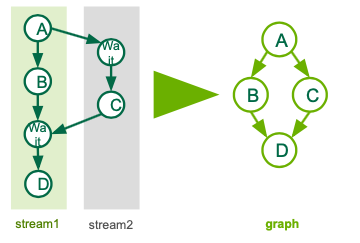

# 013_CudaGraphs

In this homework we will look at two different codes, both using Cuda Graphs. These codes consist of small kernels and could see some benefit from managing the launch latency overhead better. The two codes are axpy_stream_capture and axpy_cublas, each having a verison with_fixme and from_scratch. We recommend starting with the with_fixme versions of the two code, and then trying the from_scratch if you want a challenge. The with_fixme versions will have spots where you will need to fix to get the code to run, but the framewrok is set in place. The from_scratch versions require you to implement the graph set up and logic by hand.
### Task 1
#### Stream Capture
This task will be an example of how to use stream capture with Cuda Graphs. We will be creating a graph from a sequence of kernel launchs across two streams.

We will be looking to implement the following graph, which can be helpful to see visually

This is the same example from the slides, feel free to refer to them for help and hints.

Go ahead and take a look at the code now to get a sense of the new Graph API calls. On first pass, ignore the Graph APIs and try get a sense of the underlying code and what it is doing. The kernels themselves are not doing any specific math, but represent a simple small kernel. Remember to think about the function of the two streams and refer back to the picture here to make sure you see the inherient dependencies created by the Cuda EventWait and Signal. 

### Task 2
#### Explicit Graph Creation w/ Library Call
